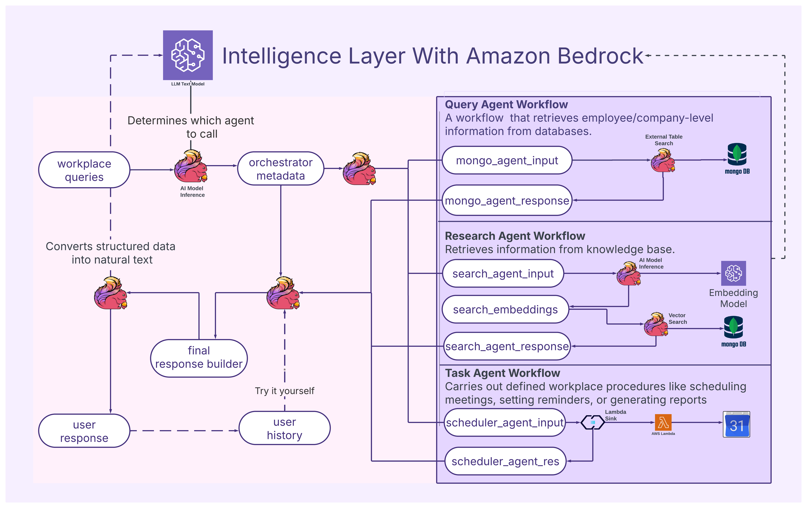
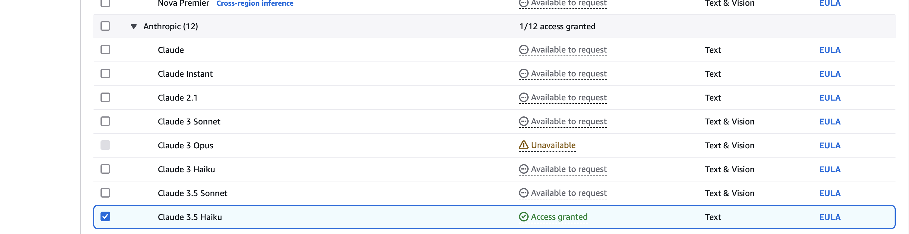
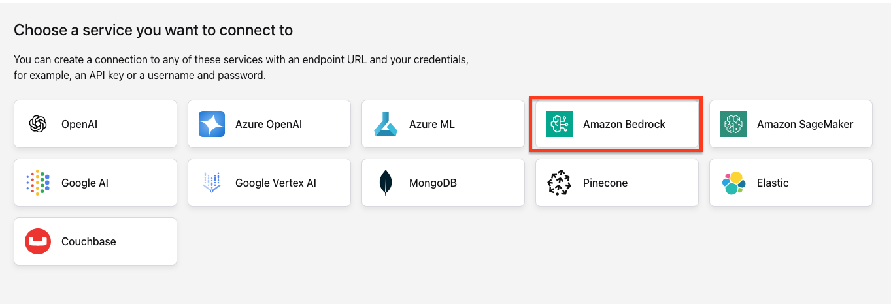
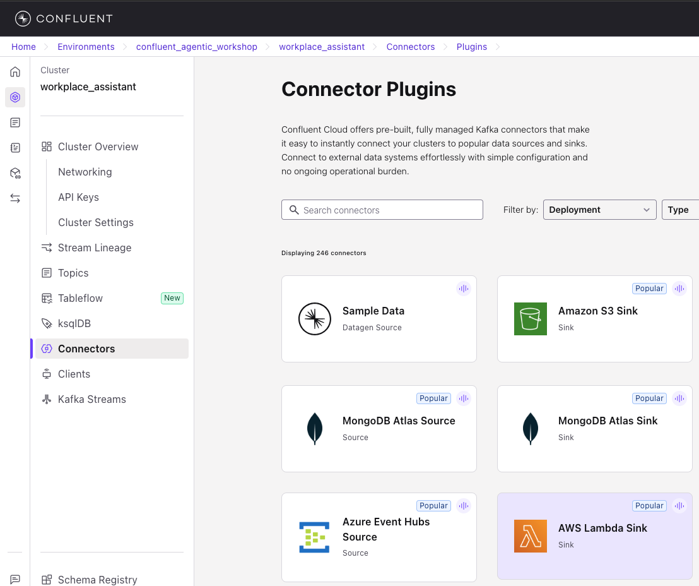
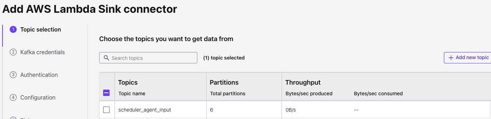
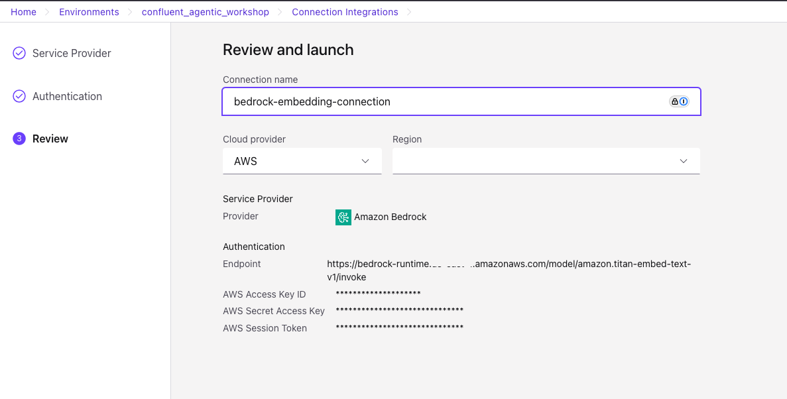

# 🧠 Multi-Agent Workplace Engagement System 

Welcome to the workshop on building a **Multi-Agent System for Workplace Engagement** using **Apache Kafka**, **Apache Flink**, and **Amazon Bedrock**. In this workshop, you'll learn to orchestrate multiple intelligent agents that collaborate to handle real-world workplace queries like scheduling meetings, retrieving company data, or answering knowledge base questions.

---

## 📘 Overview

This project demonstrates how to build an LLM-powered multi-agent system for workplace engagement. It combines real-time streaming (Flink), event-driven architecture (Kafka), vector search, and Generative AI (Amazon Bedrock) to enable interactive workflows such as:

- Querying company/employee data from SQL databases
- Searching context from internal documents using embeddings
- Executing tasks like scheduling and sending emails using automation agents

Participants will walk away with hands-on experience building a production-grade GenAI application with real-time agent coordination.

---

## 🗺️ Architecture



This architecture includes:
- **Orchestrator Agent**: Uses Bedrock LLM to decide which agents to invoke based on incoming user queries.
- **Query Agent**: Fetches data from relational databases (PostgreSQL).
- **Research Agent**: Searches company documents using vector search and embeddings.
- **Task Agent**: Performs action-oriented tasks like scheduling via calendar APIs.
- **Final Response Builder**: Joins all agent results and converts structured data into a final natural language response.

---

## ⚙️ Technologies Used

- **Apache Kafka** – Stream backbone for agent communication
- **Apache Flink** – Real-time stream processing & orchestrator logic
- **Amazon Bedrock** – Foundation model for prompt routing and response generation
- **AWS Lambda** – Task & query handler functions
- **PostgreSQL** – SQL data store
- **Mongo Vector DB** – Semantic search engine
- **LangChain / Custom Agents** – Agent interfaces

---


## Requirements
- **Local Software Requirements:** 
    - Python3 > 3.9
    - [Terraform CLI](https://developer.hashicorp.com/terraform/install)
    - [Confluent Cloud CLI](https://docs.confluent.io/confluent-cli/current/install.html)
    - [MongoDB Database Tools](https://www.mongodb.com/docs/database-tools/installation/)

- **Access:** 
    1. MongoDB Atlas Account Access - https://www.mongodb.com/
    2. AWS Account Access - Provided by workshop coordinators
    3. Confluent Cloud Account Access 

- **Sign up for Confluent Cloud**
    - Navigate to [Confluent Cloud Sign Up](https://confluent.cloud/signup?utm_campaign=tm.fm-ams_cd.Q424_AMER_GenAI_RAG_Workshop&utm_medium=workshop).
    - Sign up with any of the desired identity providers or your email ID.
        <p></p>
    - Finish creating your account by filling in a couple of details.
        <p></p>
    - Click on skip for adding your teammates for now. Feel free to add your teammates at a later point in time.
        <p></p>
    - Answer a couple of questions, and you are set to create your first cluster!
        <p></p>
    - Click on "Next" to create a cluster and enter promo code details.
        <p></p>
    - Please click on the "click_here" link on the UI to enter a promo code.
        <p></p>
    - Enter the promo code : POPTOUT0000EK38
        <p></p>

---

## 🚀 Quick Start (TL;DR)

1. ### Clone the workshop Github Repo on your local
    ```bash
    git clone https://github.com/RakeshNKundar/multi-agent-streaming-system-with-confluent.git
    ```

1. ### Create a Confluent Cloud API Key
    Create Confluent Cloud API Key for your confluent cloud account with resource scope as Cloud resource management.
    - Go to https://confluent.cloud/settings/api-keys 
    - Add API Key 
    - Cloud resource management 
    - Download API Key 

    <p></p>


1. ### Create a MongoDB Programmatic Access API Key
    Create MongoDB Programmatic Access api key for your mongo account - https://www.mongodb.com/docs/atlas/configure-api-access-org/
    * In Atlas, go to the Organization Access Manager page.
    * Click the Applications tab
    * Click on Create API Key with Organization Owner Permissions
    * Save the API Key for further use.
      <p></p>

1. ### Retrieve your AWS Access Keys from a Confluent-provided AWS account
    If an AWS account is being provided to you for this workshop, follow the below instructions. 
    * Navigate to https://catalog.us-east-1.prod.workshops.aws
    * Sign in using the `Email One Time Password` option. 
    * Once logged in, input the Event access code that you were given for this workhop. If you do not have your event access code, please notify an event supporter to obtain an access code.
    
    * Agree to the Terms and Conditions to continue
    * You'll arrive at the page where you can access your Confluent-provided AWS account. The first link will allow you to access the AWS console of your AWS account. Go ahead and click the link to open the AWS console in a new tab.

      
    * The other link provides the necessary access keys and session token to deploy resources into your Confluent-provided AWS account using Terraform. Copy and paste these values in a .txt file. You will uses these values multiple times throughout the workshop.

      
      

1. ### [Alternative] Retrieve your AWS Access Keys from an AWS account you provide
    In the event an AWS account is not provided to you for this workshop, you can use your own AWS account. When doing so you can deploy the upcoming Terraform script using [IAM Access Keys](https://docs.aws.amazon.com/IAM/latest/UserGuide/id_credentials_access-keys.html) or the [AWS CLI Profile](https://docs.aws.amazon.com/cli/v1/userguide/cli-configure-options.html) (ex. `aws configure --profile <profilename>`). 

   

4. ### Setup environment variables

  * Navigate to <b>setup/init.sh</b> and edit the following:

    ```bash
    # setup/init.sh

    export TF_VAR_cc_cloud_api_key="<Confluent Cloud API Key>"
    export TF_VAR_cc_cloud_api_secret="<Confluent Cloud API Secret>"
    export TF_VAR_mongodbatlas_public_key="<MongoDB Public API Key>"
    export TF_VAR_mongodbatlas_private_key="<MongoDB Private API Key>"
    export AWS_DEFAULT_REGION="us-west-2" #If using a Confluent-provided AWS account, make sure this region matches the region found in the above steps (most likely it will be us-west-2)
    export AWS_ACCESS_KEY_ID="<AWS Access Key ID"
    export AWS_SECRET_ACCESS_KEY="<AWS Access Key Secret>"
    export AWS_SESSION_TOKEN="<AWS Session Token>" #Only necessary if you are using a Confluent-provided AWS account or using the temporary credentials from your personal AWS account.
    ```
2. After Setting the variables, run:

    ```bash
    chmod +x ./setup/init.sh
    ./setup/init.sh
    ```

## Task 01 – Orchestrator Agent (LLM-based Decision Making)

1. Go to the AWS Console and navigate to the Amazon Bedrock service.
2. On the left hand panel, click on the `Model Access` option

    
3. Click the `Modify Access` button

    
4. Enable the following models (it is strongly recommended to only enable these models or else enablement will stall and require AWS Support):
    - Titan Embeddings G1 - Text
    - Claude 3 Sonnet
  
    It should only take 1-5 minutes for the models to enable. You will see the following when models are ready.
    
     
  

1. Login to your confluent cloud account to see the different resources deployed on your environment.

2. In a different terminal, run:
Login to confluent cloud
```bash
confluent login --save 
```
Select the environment id for the environment created on your account.
```bash
confluent env use --<YOUR_ENVIRONMENT_ID>
```
Create a FlinkSQL connection to connect to bedrock claude text model.Please replace your access keys and secrets & <env-id> before running the command.
```bash
confluent flink connection create bedrock-text-connection \
  --cloud AWS \
  --region us-east-1 \
  --environment <env-id> \
  --type bedrock \
  --endpoint https://bedrock-runtime.us-east-1.amazonaws.com/model/anthropic.claude-3-sonnet-20240229-v1:0/invoke \
  --aws-access-key <Replace with your own access key> \
  --aws-secret-key <Replace with your own access secret >
```

1. Once in the Environment view, click the Integrations tab and create a new Connection. 


1. Select Amazon Bedrock as the service with which to create a connection. 

1. Fill out the form using following:
    - Endpoint: `https://bedrock-runtime.<your_region>.amazonaws.com/model/anthropic.claude-3-sonnet-20240229-v1:0/invoke`
    - aws access key - <Replace_with_your_own_access_key> 
    - aws secret key  - <Replace_with_your_own_access_secret_key>
    - aws session token - <Replace_with_your_own_session_token>

1. Give your connection name of `bedrock-text-connection` and launch the connection. 

    


1. Next, navigate to Flink with Confluent Cloud and open your SQL workspace. 

    

```sql
CREATE MODEL BedrockGeneralModel INPUT (text STRING) OUTPUT (response STRING) COMMENT 'General model with no system prompt.'
WITH
    (
        'task' = 'text_generation',
        'provider' = 'bedrock',
        'bedrock.PARAMS.max_tokens' = '200000',
        'bedrock.PARAMS.temperature' = '0.1',
        'bedrock.connection' = 'bedrock-text-connection'
    );

```
Replace <message_field> value before running the command.

```sql
CREATE TABLE `orchestrator_metadata` AS 
SELECT 
    JSON_VALUE(response, '$.sql_agent') AS sql_agent,
    JSON_VALUE(response, '$.sql_agent_metadata.query') AS sql_agent_query,
    JSON_VALUE(response, '$.sql_agent_metadata.user_email') AS sql_agent_user_email,
    JSON_VALUE(response, '$.sql_agent_metadata.employee_id') AS sql_agent_employee_id,

    JSON_VALUE(response, '$.search_agent') AS search_agent,
    JSON_VALUE(response, '$.search_agent_metadata.query') AS search_agent_query,

    JSON_VALUE(response, '$.scheduler_agent') AS scheduler_agent,
    JSON_VALUE(response, '$.scheduler_agent_metadata.title') AS scheduler_title,
    JSON_VALUE(response, '$.scheduler_agent_metadata.description') AS scheduler_description,
    JSON_VALUE(response, '$.scheduler_agent_metadata.location') AS scheduler_location,
    JSON_VALUE(response, '$.scheduler_agent_metadata.start') AS scheduler_start,
    JSON_VALUE(response, '$.scheduler_agent_metadata.end') AS scheduler_end,
    JSON_QUERY(response, '$.scheduler_agent_metadata.attendees') AS scheduler_attendees,
    JSON_QUERY(response, '$.sequence') AS execution_sequence,`timestamp`,
message_id,user_email,session_id,employee_id,message
FROM 
    queries ,
LATERAL TABLE(
    ML_PREDICT(
        'BedrockGeneralModel',(
            'You are a query router for a multi-agent workplace assistant.

Given the user input, extract:

1. Which agents are required
2. A relevant fragment of the query for each agent — do not copy the full query unless necessary
3. Agent-specific metadata in structured JSON
4. An execution sequence, if applicable.

Descriptions of agents:

* sql\_agent: Handles employee- or department-level data queries from SQL using employee\_id or user\_email.
* search\_agent: Retrieves top documents or policies using vector search based on semantic meaning.
* scheduler\_agent: Schedules meetings or creates events using provided attendees, title, and time.

Return the result in strict JSON using this structure:

{
  "sql_agent": true | false,
  "sql_agent_metadata": {
    "query": "<original message from user>",
    "user_email": "<original user_email>",
    "employee_id": "<original employee_id>"
  },

  "search_agent": true | false,
  "search_agent_metadata": {
    "query": "<original message from user>"
  },

  "scheduler_agent": true | false,
  "scheduler_agent_metadata": {
    "title": "Meeting Title",
    "description": "Purpose of the meeting",
    "location": "Virtual",
    "start": "2025-05-06T15:00:00Z",
    "end": "2025-05-06T16:00:00Z",
    "attendees": ["<user_email or mentioned email>"]
  },

  "sequence": ["scheduler_agent", "search_agent", "sql_agent"]
}

  
' || '\n User prompt: ' ||
            '{
   message_id: ' || message_id || ','
  'employee_id: '||  employee_id || ','
  'user_email:' || user_email || ','
  'message:'|| <message_field> || '}'
        )
    )
);
```

5. Insert a sample query in the `queries` topic to test out our flink agent. 

```json
{
  "message_id": "d7a97c0a-8e5b-4c65-90cb-7ea5934ae6d4",
  "employee_id": "E001",
  "user_email": "john.smith@company.com",
  "session_id": "sess-01",
  "message": "What is company's maternal leave policy? How much am I eligible for ?",
  "timestamp": 1746717000000
}
```

5. Verify the data in the respective topics - **queries** and **orchestrator_metadata**. 

6. Take a look at the agent flags and observe which are true for the input we have given.

7. Try It Yourself ✏️:
    1. How would you change the prompt to include the SQL agent for being called?
    2. What metadata is required for the scheduler agent?
    3. Publish one more query containing “schedule a 1:1 with my manager <your email> ”, which agents will be invoked now?

## Task 2: Setup the Workflow distribution 
Now that the Orchestrator Agent is up and running, it's time to activate the specialized agents that perform actual tasks.🧩 Concept Recap
Each agent is an independent component in the system. Here's a quick breakdown:
🗄 SQL Agent: Retrieves employee or department-level data using employee_id or user_email from a SQL database.
🔎 Vector Search Agent: Uses semantic embeddings to retrieve contextually relevant documents from a MongoDB Vector Store.
📅 Scheduler Agent: Automates meeting scheduling using structured metadata like title, time, and attendees.

These agents listen on their respective Kafka input topics and output results to their own response topics (e.g., sql_agent_response, search_agent_response, scheduler_result).

So we now create three router queries which routes the message to it's repective agent inputs. 


🔹 SQL Agent Routing 
Can you add the flag condition which will help us determine routing the request to sql_agent_input ?
```sql
CREATE TABLE sql_agent_input AS 
SELECT 
    CAST(message AS BYTES) AS key,
    sql_agent_query as query, 
    message_id , 
    employee_id , 
    user_email , 
    message,
    session_id , 
    `timestamp`
FROM orchestrator_metadata 
where <Enter the condition here>; 
```

🔹 Search Agent (Vector)
Can you add the flag condition which will help us determine routing the request to search_agent_input ?

```sql
CREATE TABLE search_agent_input AS 
SELECT 
    CAST(message AS BYTES) AS key,
    search_agent_query as query, 
    message_id , 
    employee_id , 
    user_email , 
    message,
    session_id , 
    `timestamp`
FROM orchestrator_metadata 
where <Enter the condition here>; 
```

🔹 Scheduler Agent
Can you add the flag condition which will help us determine routing the request to scheduler_agent_input ?

```sql
CREATE TABLE scheduler_agent_input AS 
SELECT 
    CAST(message AS BYTES) AS key,
    scheduler_title as title, 
    scheduler_description as `description` ,
    scheduler_location as `location`,
    scheduler_start as `start`,
    scheduler_end as `end`,
    message_id , 
    employee_id , 
    user_email , 
    message,
    session_id , 
    `timestamp`,
  SPLIT(
  REGEXP_REPLACE(scheduler_attendees, '\\["|\\"]', ''), '","'
) AS attendees
FROM orchestrator_metadata
WHERE <Enter the condition here>; 
```
Verify the data in the respective topics - **sql_agent_input**, **search_agent_v2** and **scheduler_agent_input**.If any of these topics are empty, it likely means you haven’t triggered a user query that would activate the corresponding agent.

👉 Next Step:
Create a few test queries that would intentionally route to each of these agents. For example:

"How many people are in the engineering team?" → SQL Agent
```json
{
  "message_id": "6f0e8192-9a14-49a7-9a22-6fc324d7d4co",
  "employee_id": "E001",
  "user_email": "john.smith@company.com",
  "session_id": "sess-01",
  "message": "How many people are in the engineering department?",
  "timestamp": 1746717000000
}
```

"Can you help me understand hybrid Compensation & performance structure ?" → Search Agent
```json
{
  "message_id": "8f0e8192-9a14-49a7-9a22-6fc324d7d4ci",
  "employee_id": "E001",
  "user_email": "john.smith@company.com",
  "session_id": "sess-01",
  "message": "Can you help me understand hybrid Compensation & performance structure ?",
  "timestamp": 1746717000000
}
```

"Schedule a skip-level meeting with my manager next week" → Scheduler Agent
```json
{
  "message_id": "9f0e8192-9a14-49a7-9a22-6fc324d7ddghe",
  "employee_id": "E001",
  "user_email": "john.smith@company.com",
  "session_id": "sess-01",
  "message": "Schedule a skip-level meeting with my manager  <your_email_id> next week",
  "timestamp": 1746717000000
}
```

This will help populate the input topics and allow you to test the complete agent workflow.

## Task 3: Integrate SQL Agent with Lambda Sink Connector
This task helps you build a fully managed Lambda Kafka Sink Connector that routes your queries to a SQL lambda agent.
Goal:
Stream sql_agent_input Kafka topic data directly to your AWS Lambda.

Before creating the connector, make sure the Lambda is properly configured.
- Open the AWS Console.
- Search for and open your Lambda function (e.g., sql_agent).
- Add the following environment variables to the function:
- Add below enviorment variable values: 

```bash
sql_agent_result_topic=sql_agent_response
```

Once your Lambda is ready, proceed to configure the Confluent-managed Kafka Sink Connector to invoke this function on every message received in sql_agent_input.

Step-by-step Setup for Connector:
1. Go to Confluent Cloud > Connectors.

2. Select AWS Lambda Sink Connector from the available connectors.

3. Fill in the relevant configuration details below and deploy the connector.
```json
{
  "config": {
    "topics": "sql_agent_input",
    "schema.context.name": "default",
    "input.data.format": "AVRO",
    "connector.class": "LambdaSink",
    "name": "SqlAgentSink",
    "kafka.auth.mode": "KAFKA_API_KEY",
    "kafka.api.key": "<YOUR_KAFKA_API_KEY>",
    "kafka.api.secret": "****************************************************************",
    "authentication.method": "Access Keys",
    "aws.access.key.id": "********************",
    "aws.secret.access.key": "****************************************",
    "aws.lambda.configuration.mode": "single",
    "aws.lambda.function.name": "sql_agent",
    "aws.lambda.invocation.type": "sync",
    "aws.lambda.batch.size": "20",
    "record.converter.class": "JsonKeyValueConverter",
    "aws.lambda.socket.timeout": "50000",
    "behavior.on.error": "log",
    "max.poll.interval.ms": "300000",
    "max.poll.records": "500",
    "tasks.max": "1",
    "auto.restart.on.user.error": "true",
    "value.converter.decimal.format": "BASE64",
    "value.converter.reference.subject.name.strategy": "DefaultReferenceSubjectNameStrategy",
    "value.converter.value.subject.name.strategy": "TopicNameStrategy",
    "key.converter.key.subject.name.strategy": "TopicNameStrategy"
  }
}
```


## Task 4: Context Retrieval via Vector Search 
We now add intelligence to our Research Agent using Amazon Bedrock embeddings + MongoDB vector search.

1. Create a FlinkSQL connection to connect to bedrock text embedding model.Please replac your own keys before running the command.
```bash
confluent flink connection create bedrock-embedding-connection \
  --cloud AWS \
  --region 	us-east-1 \
  --environment <env-id> \
  --type bedrock \
  --endpoint https://bedrock-runtime.us-east-1.amazonaws.com/model/amazon.titan-embed-text-v1/invoke \
  --aws-access-key <Replace with your own access key> \
  --aws-secret-key <Replace with your own access secret >
```


Log in to your confluent cloud env and access flink workspace(UI tool to run your flinksql queries) to run following queries:

2. Create Bedrock Model in Flink SQL
```sql
CREATE MODEL bedrock_embed
INPUT (text STRING)
OUTPUT (response ARRAY<FLOAT>)
WITH (
  'bedrock.connection'='bedrock-embedding-connection',
  'bedrock.input_format'='AMAZON-TITAN-EMBED',
  'provider'='bedrock',
  'task'='embedding'
);
```

3. Embed User Queries
```sql
CREATE TABLE search_embeddings AS 
SELECT CAST(message_id AS BYTES) as key,`response` as query_embedding, query ,message_id ,employee_id ,user_email,message,session_id ,`timestamp` from `search_agent_input`, 
LATERAL TABLE(
    ML_PREDICT(
        'bedrock_embed',(
            'queryFromEmployee: ' || query 
        )
    )
);
```
4. This task helps you build a fully managed Lambda Kafka Sink Connector that routes your queries to a Search lambda agent , similar to how we did it for a sql agent.
Goal: Stream search_embeddings Kafka topic data directly to your AWS Lambda.
Before creating the connector, make sure the Lambda is properly configured.
- Open the AWS Console.
- Search for and open your Lambda function (e.g., sql_agent).
- Add the following environment variables to the function:
- Add below enviorment variable values: 

```bash
search_agent_result_topic=search_agent_response
```
Once your Lambda is ready, proceed to configure the Confluent-managed Kafka Sink Connector to invoke this function on every message received in search_embeddings.

Step-by-step Setup for Connector:
  1. Go to Confluent Cloud > Connectors.

  2. Select AWS Lambda Sink Connector from the available connectors.

  3. Fill in the relevant configuration details below and deploy the connector.
  ```json
  {
  "config": {
    "topics": "search_embeddings",
    "schema.context.name": "default",
    "input.data.format": "AVRO",
    "connector.class": "LambdaSink",
    "name": "SearchAgent_Sink",
    "kafka.auth.mode": "KAFKA_API_KEY",
    "kafka.api.key": "<YOUR_KAFKA_API_KEY>",
    "kafka.api.secret": "****************************************************************",
    "authentication.method": "Access Keys",
    "aws.access.key.id": "********************",
    "aws.secret.access.key": "****************************************",
    "aws.lambda.configuration.mode": "single",
    "aws.lambda.function.name": "search_agent",
    "aws.lambda.invocation.type": "sync",
    "aws.lambda.batch.size": "20",
    "record.converter.class": "JsonKeyValueConverter",
    "aws.lambda.socket.timeout": "50000",
    "behavior.on.error": "log",
    "max.poll.interval.ms": "300000",
    "max.poll.records": "500",
    "tasks.max": "1",
    "auto.restart.on.user.error": "true",
    "value.converter.decimal.format": "BASE64",
    "value.converter.reference.subject.name.strategy": "DefaultReferenceSubjectNameStrategy",
    "value.converter.value.subject.name.strategy": "TopicNameStrategy",
    "key.converter.key.subject.name.strategy": "TopicNameStrategy"
  }
  }
  ``` 

## Task 5: Integrate Scheduler Agent with Lambda Sink Connector
This task helps you build a fully managed Lambda Kafka Sink Connector that routes your queries to a Scheduler lambda agent , similar to how we did it for a sql agent.
Goal:
Stream scheduler_agent_input Kafka topic data directly to your AWS Lambda.

Before creating the connector, make sure the Lambda is properly configured.
- Open the AWS Console.
- Search for and open your Lambda function (e.g., scheduler_agent).
- Add the following environment variables to the function:
- Add below enviorment variable values: 

```bash
scheduler_agent_result_topic=scheduler_agent_response
```

Step-by-step Setup:
1. Go to Confluent Cloud > Connectors.

2. Select AWS Lambda Sink Connector from the available connectors.


3. Select the `sql_agent_input` topic. Each time a record lands in this topic, the Lambda function will get triggered. 

1. During the authentication part, be sure you point this connector to the `sql_agent` Lambda function and that you use the `IAM Roles` as the authentication method. The `Provider Integration` you created earlier is what you select last.

    

1. Set the Input Kafka record value format to `AVRO`. Leave all other values as default/empty.
sql_agent

1. Lastly, provide your connector a name of `SQLAgentSink`

## Task 4: Context Retrieval via Vector Search 
We now add intelligence to our Research Agent using Amazon Bedrock embeddings + MongoDB vector search.

1. Navivigate to the Integrations tab within your environment and create a anothers Connections integration. This time with the the following: 
 - Name: `bedrock-embedding-connection` 
 - Endpoint: `https://bedrock-runtime.<your_current_region>.amazonaws.com/model/amazon.titan-embed-text-v1/invoke`. 
 
    


    The end result should look like this:
    


1. Navigate back to Flink and run the following queries:

    Create Bedrock Model in Flink SQL
    ```sql
    CREATE MODEL bedrock_embed
    INPUT (text STRING)
    OUTPUT (response ARRAY<FLOAT>)
    WITH (
      'bedrock.connection'='bedrock-embedding-connection',
      'bedrock.input_format'='AMAZON-TITAN-EMBED',
      'provider'='bedrock',
      'task'='embedding'
    );
    ```

3. Embed User Queries
    ```sql
    CREATE TABLE search_embeddings AS 
    SELECT CAST(message_id AS BYTES) as key,`response` as query_embedding, query ,message_id ,employee_id ,user_email,message,session_id ,`timestamp` from `search_agent_input`, 
    LATERAL TABLE(
        ML_PREDICT(
            'bedrock_embed',(
                'queryFromEmployee: ' || query 
            )
        )
    );
    ```
4. This task helps you build a fully managed Lambda Kafka Sink Connector that routes your queries to a Search lambda agent , similar to how we did it for a sql agent.
Goal: Stream search_embeddings Kafka topic data directly to your AWS Lambda.
Step-by-step Setup:
  1. Go to Confluent Cloud > Connectors.

  2. Select AWS Lambda Sink Connector from the available connectors.

  3. Fill in the relevant configuration details below and deploy the connector. *Leave all other values that are not shown below as default or empty.*
      - Topic: search_embeddings
      - AWS Lambda function name: search_agent
      - Authentication Method: IAM Roles
      - Provider Integration Name: <the AWS Lambda Sink integration you set up>
      - Input Kafka record value format: AVRO
      - Connector name: SearchAgentSink


   


## Task 5: Integrate Scheduler Agent with Lambda Sink Connector
This task helps you build a fully managed Lambda Kafka Sink Connector that routes your queries to a Scheduler lambda agent , similar to how we did it for a sql agent.

Goal:
Stream scheduler_agent_input Kafka topic data directly to your AWS Lambda.


1. Set up one more AWS Lambda Sink Connector using the configuration details below and deploy the connector. *Leave all other values that are not shown below as default or empty.*
      - Topic: scheduler_agent_input
      - AWS Lambda function name: scheduler_agent
      - Authentication Method: IAM Roles
      - Provider Integration Name: <the AWS Lambda Sink integration you set up>
      - Input Kafka record value format: AVRO
      - Connector name: SchedulerAgentSink


3. Fill in the relevant configuration details below and deploy the connector.
```json
{
  "config": {
    "topics": "scheduler_agent_input",
    "schema.context.name": "default",
    "input.data.format": "AVRO",
    "connector.class": "LambdaSink",
    "name": "SchedulerAgentSink",
    "kafka.auth.mode": "KAFKA_API_KEY",
    "kafka.api.key": "<YOUR_KAFKA_API_KEY>",
    "kafka.api.secret": "****************************************************************",
    "authentication.method": "Access Keys",
    "aws.access.key.id": "********************",
    "aws.secret.access.key": "****************************************",
    "aws.lambda.configuration.mode": "single",
    "aws.lambda.function.name": "scheduler_agent",
    "aws.lambda.invocation.type": "sync",
    "aws.lambda.batch.size": "20",
    "record.converter.class": "JsonKeyValueConverter",
    "aws.lambda.socket.timeout": "50000",
    "behavior.on.error": "log",
    "max.poll.interval.ms": "300000",
    "max.poll.records": "500",
    "tasks.max": "1",
    "auto.restart.on.user.error": "true",
    "value.converter.decimal.format": "BASE64",
    "value.converter.reference.subject.name.strategy": "DefaultReferenceSubjectNameStrategy",
    "value.converter.value.subject.name.strategy": "TopicNameStrategy",
    "key.converter.key.subject.name.strategy": "TopicNameStrategy"
  }
}
```
## Task 06 (Optional) – Integrating Email service with Scheduler agent using AWS SNS
You can send email notifications to about the meeting from the scheduler agent using AWS SNS service. The Scheduler agent pushes events to the SNS service. You can create an E-mail subscription out of the SNS topic using your email address to receive email notification.

You need to create an email subscription on AWS SNS

  - Go to AWS SNS --> Click Subscription. 
  - Fill in the details like the SNS topic arn, 
      - Set Protocol = <b>Email</b>
      - Type in your email address
  
  <p></p>

Create a subscription and verify your email address via an email sent by SNS service.

Once the email is verified you'll receive emails about the new events when a scheduler agent creates one.


## Task 07 – Final Agent Builder Join & response input Structuring
Now that all three agents (SQL, Search, Scheduler) have emitted results, we perform a final conditional join with the orchestrator metadata. This gives us a fully enriched context for each user query.

🔹 Step 1: Join All Agent Results
This query joins orchestrator_metadata with the three agent response topics conditionally, based on which agents were triggered (sql_agent, search_agent, scheduler_agent).
```sql
CREATE TABLE enriched_query_with_agent_responses(
event_time TIMESTAMP(3),
  WATERMARK FOR event_time AS event_time - INTERVAL '1' SECOND)
 with('changelog.mode'='append')  AS
SELECT
  o.sql_agent,
  o.sql_agent_query,
  o.sql_agent_user_email,
  o.sql_agent_employee_id,
  o.search_agent,
  o.search_agent_query,
  o.scheduler_agent,
  o.scheduler_title,
  o.scheduler_description,
  o.scheduler_location,
  o.scheduler_start,
  o.scheduler_end,
  o.scheduler_attendees,
  o.execution_sequence,
  o.`$rowtime` as event_time,
  o.message_id,
  o.user_email,
  o.session_id,
  o.employee_id,
  o.message,
  CASE 
        WHEN o.sql_agent = 'true' 
         AND s.`$rowtime` BETWEEN o.`$rowtime` - INTERVAL '5' MINUTE AND o.`$rowtime` + INTERVAL '5' HOUR 
        THEN s.sql_result 
        ELSE NULL 
      END AS employee_info,
  CASE 
        WHEN o.search_agent = 'true' 
         AND c.`$rowtime` BETWEEN o.`$rowtime` - INTERVAL '5' MINUTE AND o.`$rowtime` + INTERVAL '5' HOUR 
        THEN c.`search_result_summary` 
        ELSE NULL 
      END AS additional_context,
  CASE 
        WHEN o.scheduler_agent = 'true' 
         AND sch.`$rowtime` BETWEEN sch.`$rowtime` - INTERVAL '5' MINUTE AND sch.`$rowtime` + INTERVAL '5' HOUR 
        THEN sch.`title`
        ELSE NULL 
      END AS meeting_title
  -- Add scheduler result fields if needed
FROM orchestrator_metadata o , sql_agent_response s ,search_agent_response c ,scheduler_agent_response sch
  where o.message_id = s.message_id
  AND o.sql_agent = 'true'
  AND s.`$rowtime` BETWEEN o.`$rowtime` - INTERVAL '5' MINUTE AND o.`$rowtime` + INTERVAL '5' HOUR
  OR ( o.message_id = c.message_id
  AND o.search_agent = 'true'
  AND c.`$rowtime` BETWEEN o.`$rowtime` - INTERVAL '5' MINUTE AND o.`$rowtime` + INTERVAL '5' HOUR )
  OR ( o.message_id = sch.message_id
  AND o.scheduler_agent = 'true'
  AND sch.`$rowtime` BETWEEN o.`$rowtime` - INTERVAL '5' MINUTE AND o.`$rowtime` + INTERVAL '5' HOUR) ;
  ```
🔹 Step 2: Filter Latest Version per Message

Now that agent data is joined with metadata, we only want the most recent version per message ID, so we don’t emit multiple rows per 10-second interval.
```sql
CREATE TABLE final_response_builder AS 
SELECT sql_agent,sql_agent_query,search_agent,search_agent_query,scheduler_agent,scheduler_title,scheduler_description,execution_sequence,event_time,message_id,user_email,session_id,employee_id,message,employee_info,additional_context
FROM (
    SELECT *,
           ROW_NUMBER() OVER (
               PARTITION BY window_start, window_end, message_id 
               ORDER BY event_time DESC
           ) AS row_num
    FROM TABLE(
        TUMBLE(TABLE enriched_query_with_agent_responses,
               DESCRIPTOR(event_time), 
               INTERVAL '10' SECOND)
    )
)
WHERE row_num = 1;

```
Explanation:

- We use a TUMBLE window on the joined table to group outputs every 10 seconds.

- The ROW_NUMBER() function selects the latest event per message ID within the window.

- This filters out older or duplicate outputs and prepares a clean stream for the final response.


## Task 08 – Final Response Generation (Natural Language)
Once all agent responses are joined and filtered into a clean stream (final_response_builder), we use a Bedrock LLM to formulate a natural language answer. This is the final response a user would see in Slack, email, or a chatbot.

🔹 Step 1: Define Prompt Template for Bedrock
We'll send a structured prompt to the LLM, containing:
- The original user message
- Agent metadata
- Results from each agent
- Execution sequence (optional but useful for reasoning)


```sql
CREATE TABLE user_friendly_agent_response
WITH ('changelog.mode' = 'append') AS
SELECT 
  message_id,user_email,session_id,employee_id,message,`response` as final_response_text FROM final_response_builder,
LATERAL TABLE(
  ML_PREDICT(
    'BedrockGeneralModel',
    'You are a helpful workplace assistant. Summarize the structured agent responses below into a natural and helpful reply to the user.' || '\n\n' ||

    '---' || '\n' ||
    'Original message: ' || message || '\n\n' ||

    'SQL Agent Triggered: ' || sql_agent || '\n' ||
    'Employee/Department Level Info Result obtained from SQL agent: ' ||  IFNULL(employee_info, 'none') || '\n\n' ||

    'Search Agent Triggered: ' || search_agent || '\n' ||
    'Search Result: ' || IFNULL(additional_context, 'none') || '\n\n' ||

    'Scheduler Agent Triggered: ' || scheduler_agent || '\n' ||
    'Meeting Title: ' ||  IFNULL(scheduler_title, 'none') || '\n' ||
    'Description: ' ||  IFNULL(scheduler_description, 'none') || '\n' ||

    'Execution Sequence: ' || IFNULL(execution_sequence, 'none') || '\n\n' ||

    'Generate a complete, professional answer below:\n'
  )
 );
```

✅ Example Output
If a user asked:
"Can you schedule a 30-minute meeting with Alice and show me her department's last month performance?"

And all agents responded, the final result might be:

"I've scheduled a 30-minute meeting titled 'Project Discussion' with Alice at 3 PM tomorrow. Her department's performance for last month shows a 12% increase in output. I've also attached a document detailing her recent projects."

## End of Workshop.

# If you don't need your infrastructure anymore, do not forget to delete the resources!
- Log in to Confluent Cloud.

- Click on your organization name in the top left corner.

- Select the "Environments" tab.

- Click on the environment ,click `delete environment` button on the right side.

- Choose "Delete".


